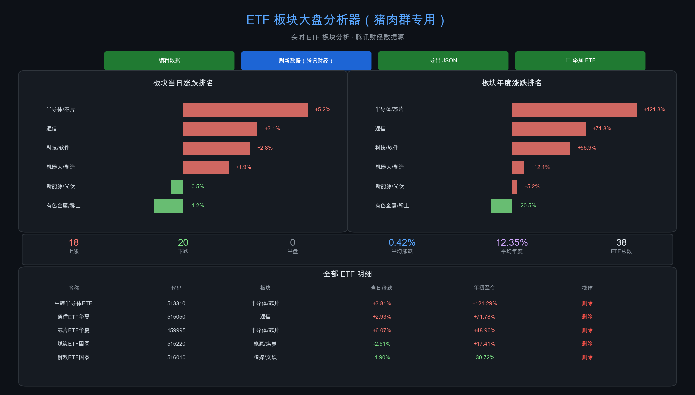
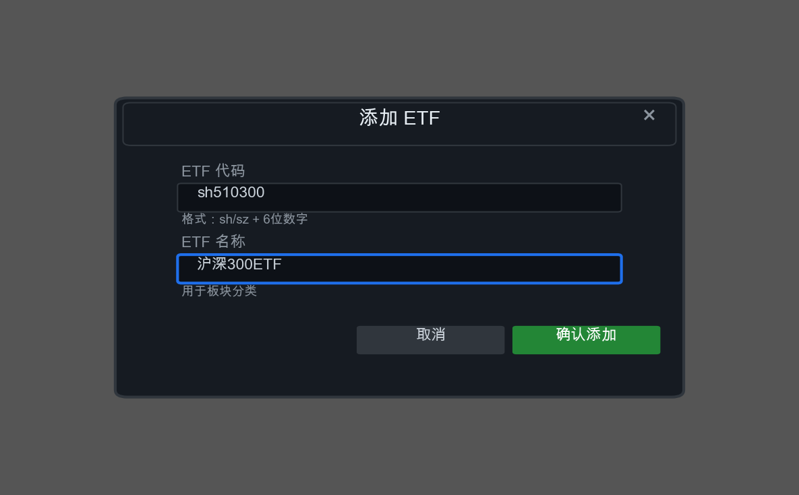

# ETF 板块大盘分析器（猪肉群专用）

[](https://github.com/xinbs/stock_etf_analysis)
[](https://qt.gtimg.cn)
[](LICENSE)

> 实时追踪 ETF 板块涨跌，精准把握市场脉搏。专为关注 ETF 的投资者设计，数据直接来自腾讯财经公开 API，无需第三方依赖。

---

## 📸 截图预览

### 全屏分析界面


### 添加 ETF 对话框


---

## ✨ 功能特性

- **实时数据** — 日涨跌数据直接来自腾讯财经 API，秒级刷新
- **实时 YTD 计算** — 通过 K 线数据实时计算年初至今涨幅，非硬编码
- **智能板块分类** — 根据 ETF 名称自动归类到 20+ 个板块（半导体、通信、新能源、金融等）
- **可视化图表** — ECharts 水平柱状图展示板块排名，涨跌一目了然
- **灵活管理** — 支持添加/删除 ETF，自定义关注列表
- **弹窗对话框** — 添加 ETF 不占用主界面，监控版面整洁
- **多入口访问** — 扩展 popup + 全屏页面 + 独立 HTML 文件
- **数据导出** — 支持导出 JSON 格式的 ETF 数据

---

## 📊 数据源

| 数据类型 | 来源 | 说明 |
|---------|------|------|
| 实时价格/日涨跌 | `qt.gtimg.cn` | 腾讯财经实时行情 |
| 年初至今涨幅 | `web.ifzq.gtimg.cn` | 腾讯 K 线数据，实时计算 YTD |
| 板块分类 | 本地规则引擎 | 基于名称关键词智能分类 |

**不依赖第三方服务**，无需爱盯盘或其他插件，独立运行。

---

## 🚀 安装方法

### 方式一：本地加载（开发/测试）

1. 克隆仓库
   ```bash
   git clone git@github.com:xinbs/stock_etf_analysis.git
   cd stock_etf_analysis
   ```

2. 打开 Chrome 扩展管理页
   ```
   chrome://extensions
   ```

3. 开启**开发者模式**（右上角开关）

4. 点击 **"加载已解压的扩展程序"**

5. 选择 `stock_etf_analysis` 目录

### 方式二：打包安装（正式使用）

1. 在 `chrome://extensions` 开启开发者模式
2. 点击 **"打包扩展程序"**
3. 选择扩展根目录，生成 `.crx` 文件
4. 拖拽 `.crx` 文件到 Chrome 安装

---

## 📖 使用说明

### 1. 打开全屏分析
点击扩展图标 → **"📂 打开全屏"**，或直接在扩展管理页打开 `full.html`。

### 2. 刷新数据
点击 **"刷新数据（腾讯财经）"** 按钮，约 1-3 秒获取最新数据：
- 38 只 ETF 的实时价格和日涨跌
- 38 只 ETF 的年初收盘价（并发请求）
- 实时计算 YTD 涨幅

### 3. 添加 ETF
点击 **"➕ 添加 ETF"** → 输入代码（如 `sh510300`）和名称（如 `沪深300ETF`）→ 确认添加。

代码格式：`sh`/`sz` + 6 位数字，如：
- `sh510300` — 沪深 300 ETF
- `sz159915` — 创业板 ETF

### 4. 删除 ETF
在明细表格中点击对应行的 **"删除"** 按钮，确认后移除。

### 5. 排序
点击表头（名称、代码、板块、当日涨跌、年初至今）按列排序。

### 6. 导出数据
点击 **"导出 JSON"** 按钮，下载当前 ETF 列表的 JSON 文件。

---

## 📁 文件结构

```
stock_etf_analysis/
├── manifest.json      # 扩展配置（MV3）
├── popup.html         # 弹出面板 HTML
├── popup.js           # 弹出面板逻辑（直接 fetch 腾讯 API）
├── full.html          # 全屏分析页面（sandbox 页面）
├── full.js            # 全屏分析逻辑（图表渲染、添加/删除 ETF）
├── background.js      # Service Worker（数据获取、存储）
├── content.js         # 内容脚本（预留）
├── echarts.min.js     # ECharts 图表库（本地）
├── icon16.png         # 图标
├── icon48.png
└── icon128.png
```

---

## 🛠️ 技术栈

- **Chrome Extension Manifest V3**
- **Vanilla JavaScript**（无框架依赖）
- **ECharts 5.4.3**（本地 bundle，无需 CDN）
- **腾讯财经公开 API**（`qt.gtimg.cn` + `web.ifzq.gtimg.cn`）

---

## ⚠️ 注意事项

1. **网络要求** — 插件需要访问腾讯财经 API（`*.gtimg.cn`），请确保网络可以正常访问
2. **YTD 计算** — 基于年初第一个交易日的收盘价计算，如果 ETF 是年内新上市，YTD 可能为 0
3. **中文名称** — 腾讯 API 返回的中文名称存在乱码问题，添加 ETF 时需手动输入正确名称用于分类
4. **数据缓存** — 刷新后的数据会缓存到 `chrome.storage.local`，下次打开优先读取缓存
5. **并发限制** — 刷新时会并发 38+ 个请求获取 K 线数据，若网络较慢请耐心等待

---

## 📝 更新日志

### v1.0 (2026-06-17)
- 初始版本发布
- 实时 ETF 板块分析
- 支持添加/删除 ETF
- 弹窗对话框交互
- 实时 YTD 计算

---

## 🤝 贡献

欢迎提交 Issue 和 PR！

**当前关注 ETF 列表**（38 只）：

| 板块 | ETF 示例 |
|------|---------|
| 半导体/芯片 | 中韩半导体、科创芯片、芯片 ETF |
| 通信 | 通信 ETF 华夏、通信 ETF 国泰 |
| 金融/非银 | 证券 ETF、券商 ETF |
| 新能源 | 新能源车、光伏、新能源 ETF |
| 医药/医疗 | 医疗 ETF、医疗创新、中药 ETF |
| 科技/计算机 | 计算机、云计算、软件 ETF |
| 传媒/文娱 | 传媒、游戏、影视 ETF |
| 消费 | 食品饮料、白酒、家电 ETF |
| 国防/军工 | 军工、国防 ETF |
| ... | 等等 |

---

## 📄 License

MIT License

---

> 🐷 猪肉群专用，祝各位投资顺利！
